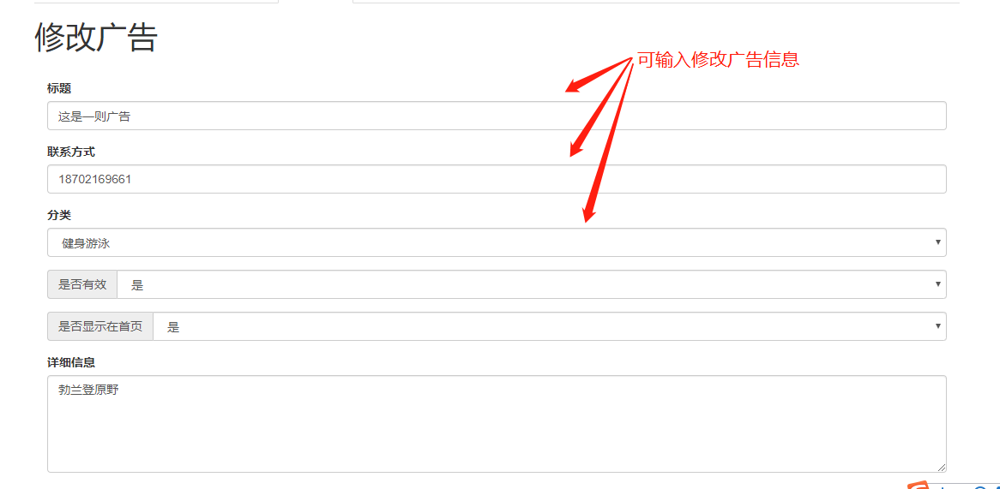

# 多多后台使用说明

---

### 登录

+ 登录界面，输入账户密码即可登录

+ 登录成功后，显示登录后的初始界面

---

### 管理员设置（查看、添加管理员，修改密码）
+ 管理员界面选项，点击对应选项进入对应功能

+ 查看管理员界面，查看所有管理员，并可按名字查找

+ 添加管理员界面，输入需要添加的管理员密码即可添加（后台不给予注册功能，仅通过该选项添加管理员）

+ 修改密码界面，输入必要信息即可修改当前用户密码

---

### 房源信息（查看新房、二手房、租房）
三者操作相同，仅展示新房操作
+ 房源信息界面选项，点击对应选项进入对应功能

+ 房源信息查看新房，默认不显示信息，点击查找按钮后显示全部新房
 
可在上方输入信息查找对应的房源，查找的信息可以包括：房源id、路段、小区、联系人（合作方）、联系电话（合作方电话）、公司（合作方公司）。
这些信息不一定要输入全部，想根据哪些信息查找，就输入哪些信息即可（不输入信息默认查找全部）
 

---

### 用户信息（查看已注册用户）
+ 查看已注册用户，可以按照号码查找用户，可以查找某个时间段内注册的用户。
 
默认不显示用户，点击查找全部用户后显示全部用户
 

---

### 合作方信息（查看、添加合作方，修改合作方信息）
+ 合作方界面，可以查看合作方，根据合作方信息查找合作方
 
添加合作方（添加合作方前要求合作方先要注册为普通用户,然后输入用户注册的电话号码添加成为合作方）
 
修改合作方，点击合作方后面的修改按钮即可进入修改界面
 

+ 修改合作方信息界面，修改信息后点击提交即可修改
 
删除合作方按钮，请谨慎使用，删除合作方后会删除该合作方发布的所有房源
 

---

### 广告管理（查看、添加、删除广告）
+ 广告管理界面，点击对应选项即可进入对应功能

+ 查看广告界面，默认显示全部广告
 
可以输入信息查找广告，可查找选项有：标题、联系方式、是否在首页、是否有效、广告分类，不必要全部输入，不输入点击查找默认查找全部
 
点击广告后面的查看详细按钮可以查看广告详细内容，点击修改广告按钮可以修改广告信息
 

+ 查看详细广告界面

+ 修改广告界面，修改广告的某些信息后，点击提交按钮即可修改广告，广告图片也可以修改，想要修改哪张图片，点击下面的按钮即可
 
删除广告按钮，点击后即可删除广告，请谨慎操作
 

+ 添加广告界面，输入广告的信息后，点击添加按钮即可添加

---

### 安装包管理（上传安卓安装包，查看更新信息）
+ 安装包管理界面，可以上传安卓安装包，并点击查看更新按钮查看更新信息

+ 更新信息界面，显示更新历史信息，点击下载按钮即可下载安装包

---

### 数据库备份
+ 数据库备份界面，点击备份数据库按钮即可下载数据库文件，下载下来的数据库文件即为备份的数据库，请妥善保管

